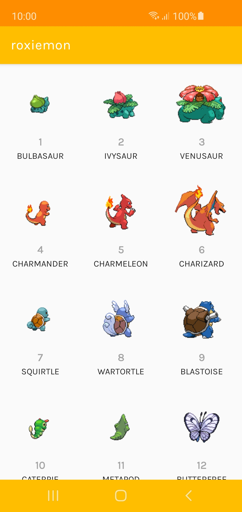
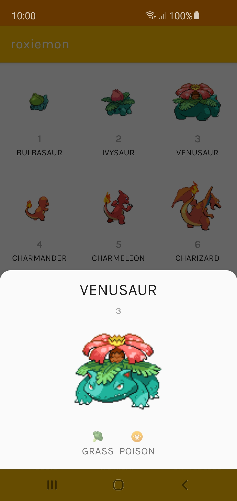
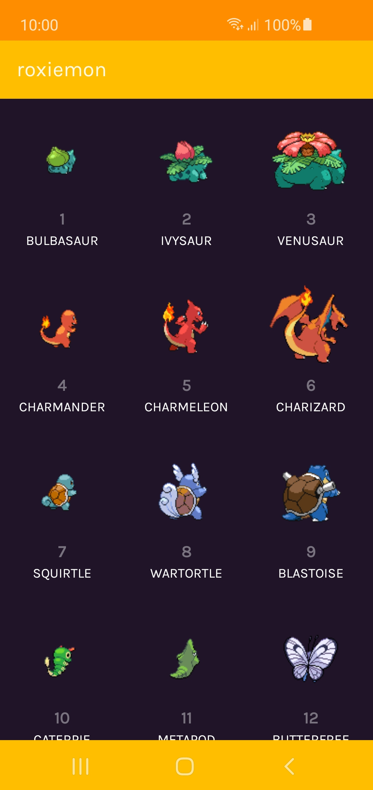
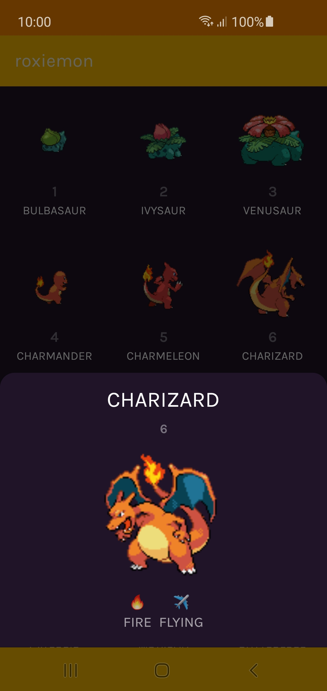

# roxiemon
👾 Android app showing Pokemon from [PokeApi](https://pokeapi.co/), written in Kotlin using [Roxie(MVI)](https://github.com/ww-tech/roxie), [RxKotlin](https://github.com/ReactiveX/RxKotlin), [Retrofit](https://square.github.io/retrofit/) and [Koin](https://insert-koin.io/).

## Screenshots
 

